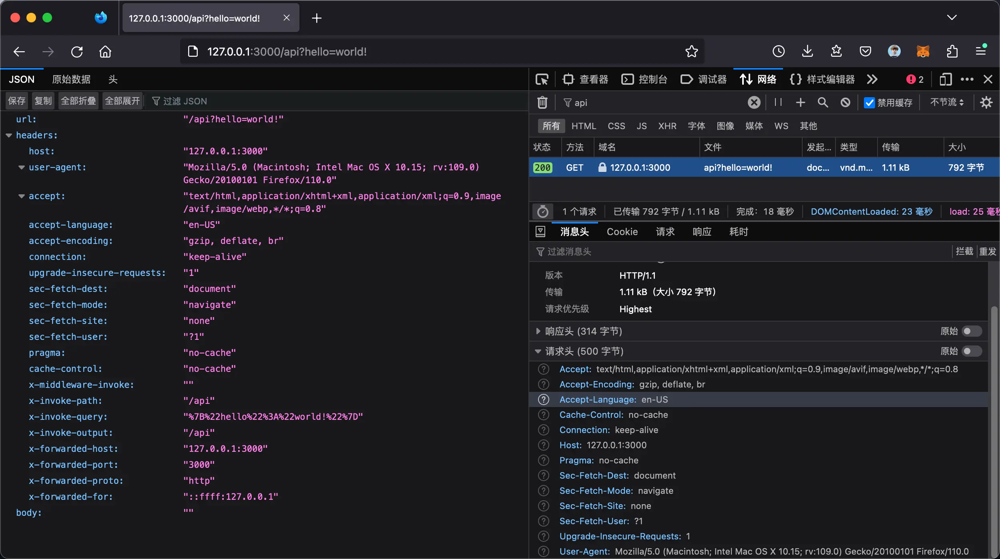

# 🩻 HTTP X-Inspector: Catch Every Request Detail

Think of HTTP X-Inspector as your go-to buddy for sniffing out what's happening with your app's web calls. It grabs every bit of the request—headers, where it's going, what it's carrying—and lays it out for you to see what's up.

## 👀 Sneak a Peek

Here’s a quick look at the HTTP X-Inspector in action – it's like having X-ray glasses for your HTTP requests!

**👉 Playground**: [https://http-x-inspector.vercel.app/api](https://http-x-inspector.vercel.app/api)

## 👨‍💻 What's the Deal?

Imagine you're using some newfangled tool to shout out to the internet from your app, and you suspect your shouts aren't quite reaching the other side. When you're just starting out or neck-deep in code, you need a way to check if you're even asking right. HTTP X-Inspector is like a mirror for your requests; it shows you what you're sending out, so you can fix any slip-ups before they drive you nuts.

## 🔧 How's it Fix Things?

You could ask your back-end buds to check their logs, but that’s a hassle. Instead, swap your API endpoint with [HTTP X-Inspector](https://http-x-inspector.vercel.app/api), and voilà, you'll see the nitty-gritty of your outgoing requests.

Heads up though: it literally spits back at you whatever you send it, whether it's the method, URL, headers, or body. So keep it out of your live app—it's just for debugging and wouldn't want to blab your secrets during prime time.
